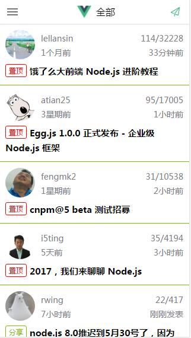
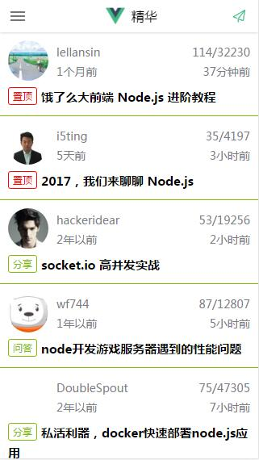
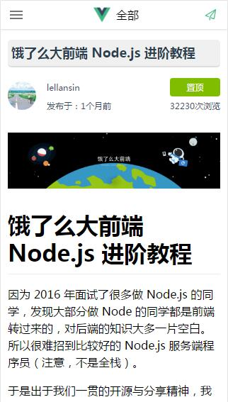
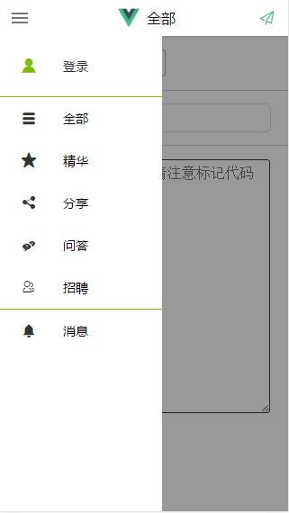
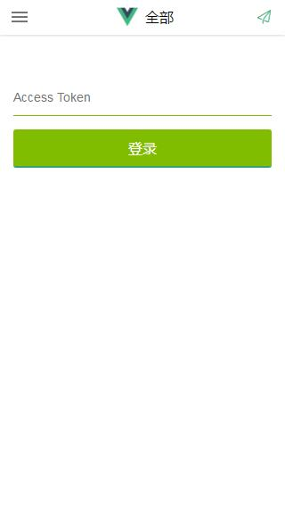
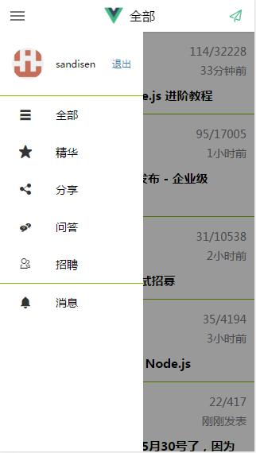
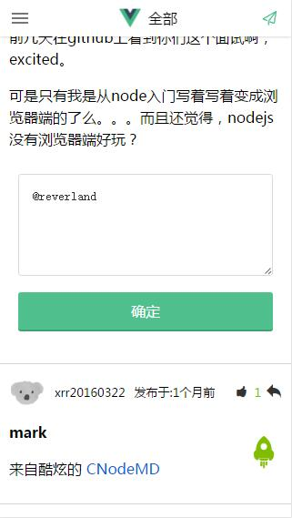
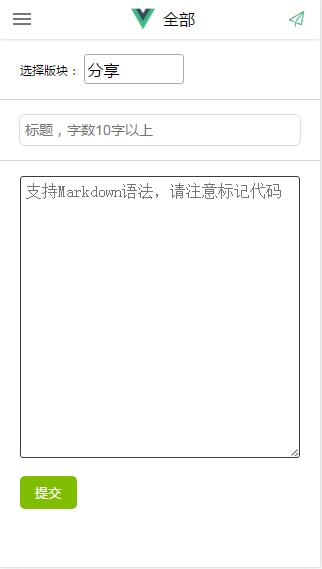

# vuedemo

> vue2.0+vue-router2.0+webpack+npm+es6



知识点：
* vue2
* vue-router2
* 移动端开发
* es6
* less

项目还在持续更新中，以后计划：
1. 优化css
2. 优化router
3. 使用vuex状态管理器
4. 加入transition效果

## Build Setup

``` bash
# install dependencies
npm install

# serve with hot reload at localhost:8080
npm run dev

# build for production with minification
npm run build

# build for production and view the bundle analyzer report
npm run build --report

# run unit tests
npm run unit

# run e2e tests
npm run e2e

# run all tests
npm test
```

访问 localhost:8090











# vue-cnode

学习vue.js前后端分离开发，熟悉并掌握vue2.0+vue-router2.0+webpack+npm+es6快速搭建项目框架，利用cnode社区提供的api实现话题列表，话题详情，发布话题，发表评论，点赞点踩等诸多功能。本人初涉vue，代码拙劣，大神请略过。如果对您有帮助，就给个star鼓励一下吧。
